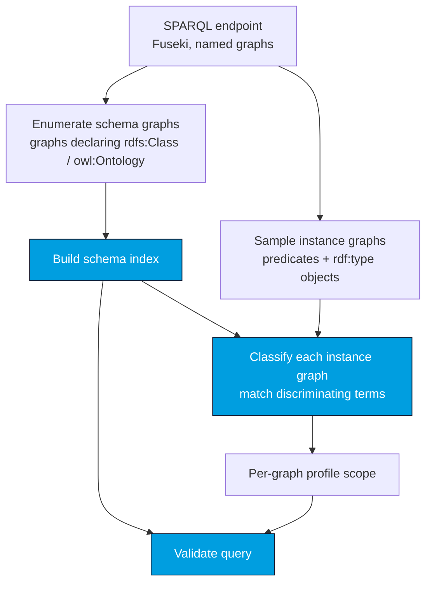

# Loading the Schema from a SPARQL Endpoint

When a SPARQL 1.1 endpoint (e.g. [Apache Jena Fuseki](https://jena.apache.org/documentation/fuseki2/))
hosts the CGMES RDFS schema **as named graphs**, CIMVocabCheck can discover the schema — and the
per-graph profile scope — automatically. No [`namedGraphs`](/cimvocabcheck/configuration#namedgraphs)
config required.

:::note The endpoint is a schema source, not a validation target
The endpoint names *where the schema lives*. CIMVocabCheck reads the RDFS profiles from it; it
never validates live instance data and never executes your query against it.
:::

## How it works



`EndpointSchemaLoader`:

1. **enumerates the schema graphs** — those declaring an `rdfs:Class` / `owl:Ontology` — and builds
   the index from them;
2. **classifies every other (instance) graph** by sampling up to 400 of its terms — the predicates
   it uses and its `rdf:type` objects — and looking each one up in the schema. A term declared by
   **exactly one** profile is *discriminating* (the "this property is in EQ but in no other profile"
   signal); the graph is assigned to the profile with the **most discriminating terms**, with the
   total number of matching terms as a tie-break. A graph whose sampled terms match no profile is
   left **unmatched**.

Classification only ever **samples** a graph to decide which profile it is — it never validates the
instance data.

## Per-graph validation — terms used in the wrong graph become errors

Once every graph is mapped to a profile, your query is validated **per graph**: the terms inside a
`GRAPH <g> { ... }` block are checked against **only** the profile detected for `<g>`, not the union
of all profiles. This is what makes auto-resolution useful — it catches terms used in the wrong
graph.

For example, if the dataset's equipment graph was detected as **Equipment (EQ)** and the query uses
a **Topology**-only property inside it:

```sparql
SELECT * WHERE {
  GRAPH <urn:uuid:...-eq> {
    ?n cim:TopologicalNode.nominalVoltage ?v .   # a TP property, inside the EQ graph
  }
}
```

CIMVocabCheck reports [`UNKNOWN_PROPERTY`](/cimvocabcheck/validation-checks) for
`cim:TopologicalNode.nominalVoltage` against the EQ graph — and because the property *does* exist in
the Topology profile, the finding lists Topology in its
[*found in other profiles*](/cimvocabcheck/validation-checks) hint, telling you the term is real but
sits in the wrong graph. Graphs the query references that were left **unmatched** (or that don't
exist in the dataset) produce a [`GRAPH_NOT_CONFIGURED`](/cimvocabcheck/validation-checks) warning,
and terms inside them cannot be resolved.

:::note When per-graph scoping applies
Auto-resolution is an **endpoint** feature. With a file-based schema and no
[`namedGraphs`](/cimvocabcheck/configuration#namedgraphs) mapping, every term is validated against
**all** loaded profiles at once, so there are no per-graph cross-profile errors. Per-graph scoping
happens either here (auto-detected from the endpoint) or when you map graphs to profiles by hand
with [`namedGraphs`](/cimvocabcheck/configuration#namedgraphs).
:::

## From Java

```java
import de.soptim.opencgmes.cimvocabcheck.core.schema.EndpointSchema;
import de.soptim.opencgmes.cimvocabcheck.core.schema.EndpointSchemaLoader;
import de.soptim.opencgmes.cimvocabcheck.core.SparqlValidationApi;
import de.soptim.opencgmes.cimvocabcheck.core.SparqlValidationResult;
import java.time.Duration;

EndpointSchema es = EndpointSchemaLoader.loadFromEndpoint(
        "http://localhost:3030/cgmes/query", Duration.ofSeconds(30));

if (!es.hasSchema()) {
    // Reachable, but no CIM schema graphs found — warn and fall back to syntax-only.
    SparqlValidationResult r = SparqlValidationApi.checkSyntaxOnly(queryText);
} else {
    SparqlValidationApi api = new SparqlValidationApi(es.index());
    // es.namedGraphScope() maps each instance graph to its detected profile(s):
    SparqlValidationResult r = api.validateSparql(queryText, es.namedGraphScope());
    // es.unmatchedGraphs() lists instance graphs that matched no known profile.
}
```

A Fuseki `…/update` URL is tolerated (its `…/query` sibling is used automatically). For in-process
datasets or tests, pass a `SparqlGraphSource` to `EndpointSchemaLoader.load(...)` instead.

`!es.hasSchema()` covers two different situations, both distinguishable via `es.schemaGraphNames()`
and `es.unresolvedReason()`:

- **No schema-like graphs at all** (`schemaGraphNames()` empty) — the endpoint genuinely hosts no
  `rdfs:Class`/`owl:Ontology` graph.
- **Schema graphs found, but none resolved to a CIM profile** (`schemaGraphNames()` non-empty,
  `unresolvedReason()` set) — almost always an unrecognized `cim` namespace. Register it with
  [`cimNamespaces`](/cimvocabcheck/configuration#cimnamespaces) in `opencgmes.jsonc` and reload.

The CLI and language server print distinct warnings for each case rather than a single generic
"no schema" message.

## From the CLI

```bash
java -jar cimvocabcheck-cli.jar \
    --endpoint http://localhost:3030/cgmes/query path/to/query.rq
```

If the endpoint exposes no CIM schema graphs, validation falls back to a **syntax-only** check with
a warning. Pass `--strict-endpoint` to make that case a hard failure (exit 2) instead — so a
misconfigured pipeline breaks visibly rather than silently checking only syntax. See the
[CLI page](/cimvocabcheck/cli).

## From a SPARQL Notebook cell

In [CIMNotebook](/cimnotebook/sparql-notebooks), a notebook cell can name its schema endpoint
inline:

```sparql
# [endpoint=http://localhost:3030/cgmes/query]
SELECT * WHERE { ?s a cim:ACLineSegment }
```

## From RDFArchitect

A [RDFArchitect](https://github.com/SOPTIM/RDFArchitect) instance can be the schema source directly,
with its own directive. Name a **dataset** of the RDFArchitect view open in your IDE to validate
against it *as you edit it*:

```sparql
# [rdfarchitect=cgmes-3.0]
SELECT * WHERE { ?s a cim:ACLineSegment }
```

or give a **link** — a snapshot from the **Share** dialog, or an instance URL with `?dataset=<name>`
— to pin a fixed source that needs no editor:

```sparql
# [rdfarchitect=http://localhost:3000/?snapshot=ffPKWuq2hw8WKBRn5VwEOA]
SELECT * WHERE { ?s a cim:ACLineSegment }
```

The graphs are exported over RDFArchitect's REST API and then run through exactly the pipeline above,
so profile detection and per-graph scoping work the same way. A live dataset is re-read when its
change log moves, so an edit made in the view reaches the next validation without a reload; the
change log is polled at most every few seconds, so a burst of typing costs one small request.

Because such a schema has no source files, `Ctrl+Click` on a term in the cell goes to a read-only
document rendered from the loaded schema — one per declaring profile — and opening it shows that
term in the editor's RDFArchitect view
([VS Code](/cimnotebook/vscode#go-to-definition), [IntelliJ](/cimnotebook/intellij#go-to-definition)).

This is deliberately **not** a value of `# [endpoint=...]`: that directive belongs to SPARQL
Notebook, which executes the cell against whatever it names, and an RDFArchitect URL there would
break execution. A cell can carry both — `endpoint` runs the query, `rdfarchitect` supplies the
schema — in which case `rdfarchitect` wins for validation. The same source can be set once for a
whole workspace with [`rdfArchitect`](/cimvocabcheck/configuration#rdfarchitect) in the config.

:::note Session-scoped datasets
RDFArchitect keeps one working copy per browser session and never publishes it. A dataset is
therefore readable only by whoever holds that session — which is why a bare dataset name needs the
RDFArchitect view open in the IDE: the extension hands that session to the language server. See
[live datasets](/cimvocabcheck/configuration#live-datasets) for what follows from that, including
why the CLI can only use snapshot links.
:::

## Assumptions & limitations

- The CGMES profiles must be stored in **per-profile named graphs** (graphs declaring
  `rdfs:Class` / `owl:Ontology`). A schema kept entirely in the default graph, or mixed with
  instance data in one graph, is not discovered.
- A profile graph that declares **neither** an `rdfs:Class` nor an `owl:Ontology` (rare — e.g. some
  header/boundary profiles) is not picked up by the enumeration filter.
- Graphs fetched over SPARQL usually carry **no prefix declarations**, so a custom `cim` namespace
  can only be recognized once it's registered — via [`cimNamespaces`](/cimvocabcheck/configuration#cimnamespaces)
  — *before* the endpoint load runs; there's no way to auto-detect an unregistered custom namespace
  from namespace-less graph content alone.

See [Known limitations](/cimvocabcheck/limitations) for the broader picture.
