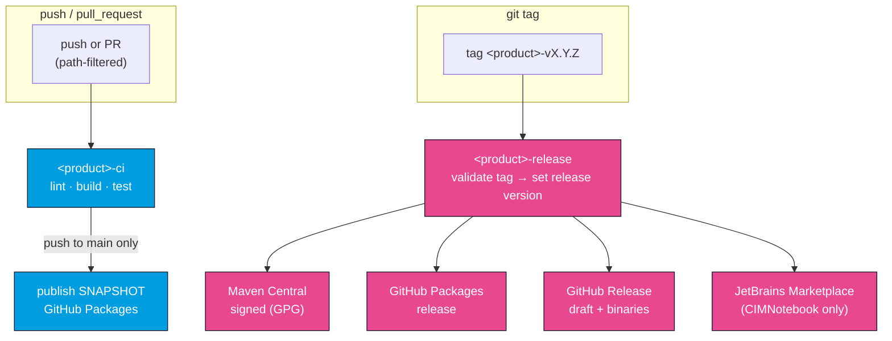

# CI & Releases

OpenCGMES ships its three products on **three independent CI/release trains**. Each product has its own `-ci` workflow (build, test, lint, publish SNAPSHOTs) and its own `-release` workflow (signed artifacts, triggered by a tag), so a change to one product never forces a release of another. Beyond the six product workflows, two more round out the repository's `.github/workflows/`: a reusable Docker-image publisher shared by the CIMVocabCheck train, and the docs site's own deploy workflow. This page describes the trains, the versioning scripts that feed them, and the supply-chain gates. See [Building](/developer-guide/building) for the underlying build commands.

## The eight workflows at a glance

| Product | CI workflow | Release workflow | Release tag | Released artifacts |
| --- | --- | --- | --- | --- |
| **CIMXML** | `cimxml-ci.yml` | `cimxml-release.yml` | `cimxml-vX.Y.Z` | Maven Central + GitHub Packages JAR; GitHub Release |
| **CIMVocabCheck** | `cimvocabcheck-ci.yml` | `cimvocabcheck-release.yml` | `cimvocabcheck-vX.Y.Z` | `cimvocabcheck-core` to Maven Central + GitHub Packages; core/cli/lsp JARs on the GitHub Release; `cimvocabcheck-cli` image to GHCR; the Python, .NET and Rust bindings to PyPI, NuGet and crates.io |
| **CIMNotebook** | `cimnotebook-ci.yml` | `cimnotebook-release.yml` | `cimnotebook-vX.Y.Z` | VSIX + IntelliJ zip on the GitHub Release; plugin to JetBrains Marketplace |

Each CI workflow is scoped by path filters, so it only runs when files it owns change (CIMVocabCheck and CIMNotebook CI also trigger on `cimxml/**` and the shared scripts, because they build against CIMXML).

Two workflows sit outside the three-train table:

- **`docker-publish.yml`** — a reusable (`workflow_call`) workflow, not triggered directly, that builds the schema-less `cimvocabcheck-cli` image and pushes it to GHCR. `cimvocabcheck-ci.yml` calls it on every push to `main` to publish the `:edge` tag; `cimvocabcheck-release.yml` calls it on a `cimvocabcheck-vX.Y.Z` tag to publish `:X.Y.Z` and `:latest`. See [CLI → Docker](/cimvocabcheck/cli#docker) for the image itself.
- **`deploy-docs.yml`** — builds and deploys this documentation site (Docusaurus) to GitHub Pages. It triggers on pushes to `main` that touch `docs/**` (or the workflow file itself), and also builds — but does not deploy — on pull requests touching the same paths, so a docs PR gets a build check without publishing.

## How the trains flow

## CI trains (push / pull request)

### CIMXML CI (`cimxml-ci.yml`)
- **build-test** — `mvn -f cimxml/pom.xml clean verify` on Java 21.
- **publish-snapshot** — on push to `main`, computes the snapshot version and deploys the `-SNAPSHOT` JAR to **GitHub Packages**.

### CIMVocabCheck CI (`cimvocabcheck-ci.yml`)
- **lint** — compiler-warnings-as-errors, then Spotless/Checkstyle/SpotBugs/PMD (no tests, for fast feedback).
- **build-test** — checks out **submodules recursively** and runs `mvn -pl cimvocabcheck/core,cimvocabcheck/cli,cimvocabcheck/lsp -am clean verify` (which also builds cimxml). This is the authoritative run, including the ENTSO-E integration tests and coverage gates.
- **python-binding** / **rust-binding** / **dotnet-binding** — each builds the CLI fat JAR and runs that binding's suite against it with `CIMVOCABCHECK_TESTS_REQUIRE_ENGINE=1`, so an engine-backed suite cannot silently start skipping. They also lint, type-check, verify the generated model still matches the schema, and dry-run the package build.
- **sbom** — regenerates the Maven SBOM and enforces the license allow-list + drift check (see below).
- **publish-snapshot** — on push to `main`, installs cimxml locally then deploys **`cimvocabcheck-core`** as a `-SNAPSHOT` to GitHub Packages. (The CLI and LSP are fat-JAR tools and are not deployed to registries.)
- **publish-edge-image** — on push to `main`, calls the reusable `docker-publish.yml` to build and push `ghcr.io/<owner>/cimvocabcheck-cli:edge`, so there is always a fresh schema-less CLI image to test against.

### CIMNotebook CI (`cimnotebook-ci.yml`)
- **typecheck-vscode** — ESLint, Prettier check, and TypeScript type-check (`npm run lint` / `format:check` / `compile`).
- **build-vsix** — sets versions, builds the LSP fat JAR from in-repo source, copies it into the extension, then `npm run bundle` + `vsce package`; uploads the VSIX as a build artifact.
- **build-intellij-plugin** — sets versions, builds the LSP fat JAR, runs `gradle spotlessCheck`, then `gradle buildPlugin`; uploads the plugin zip as an artifact.
- **sbom** — regenerates the VS Code + IntelliJ SBOMs and enforces the allow-list + drift check.

## Release trains (tag push)

Pushing an annotated tag in the form `<product>-vX.Y.Z` triggers that product's release workflow. Every release workflow first **validates the tag format** and derives the release version from it.

- **CIMXML release** — publishes a **GPG-signed** JAR to **Maven Central** (Sonatype Central Portal, `-Pcentral-release`), publishes the release to **GitHub Packages**, and creates a **draft GitHub Release** with the JAR attached.
- **CIMVocabCheck release** — publishes signed **`cimvocabcheck-core`** to Maven Central and GitHub Packages, creates a draft GitHub Release with the **core, cli, and lsp** fat JARs attached, calls the reusable `docker-publish.yml` to push the **`cimvocabcheck-cli`** image to GHCR tagged **`:X.Y.Z` and `:latest`**, and publishes the three [language bindings](/cimvocabcheck/python) to **PyPI**, **NuGet** and **crates.io**. It pins the cimxml dependency to a released version (resolved from the newest `cimxml-v*` tag) so Maven Central never sees a SNAPSHOT reference.
- **CIMNotebook release** — creates a draft GitHub Release with the **VSIX and IntelliJ zip**, and publishes the plugin to the **JetBrains Marketplace** (`gradle publishPlugin`). Unlike CI, a release bundles the LSP at the **latest released cimvocabcheck version** (resolved from the newest `cimvocabcheck-v*` tag), mirroring how it pins its other dependencies.

:::note Cross-product dependency pinning at release time
CI builds use each component's own in-repo SNAPSHOT version. Releases instead pin cross-product
dependencies to the latest released tag **reachable from `HEAD`** (cimvocabcheck → cimxml;
cimnotebook → cimvocabcheck → cimxml), because Maven Central rejects SNAPSHOT references. The cimxml
dependency is **required**: a cimvocabcheck or cimnotebook release fails if no `cimxml-v*` tag
exists. The cimnotebook release resolves the bundled cimvocabcheck version with
`compute-version.sh cimvocabcheck --released` and falls back — with a warning — to the in-repo
`0.0.0-SNAPSHOT` LSP only until the first `cimvocabcheck-v*` tag exists.
:::

## Deployment environments and credentials

Every job that pushes to a registry outside GitHub runs in its own **GitHub environment**, so each
credential is scoped to the single job that needs it and can carry its own required reviewers,
wait timer or branch/tag restriction.

| Environment | Used by | Secrets |
| --- | --- | --- |
| `Maven Central Deployment` | `cimvocabcheck-core`, `cimxml` | `CENTRAL_PORTAL_USERNAME`, `CENTRAL_PORTAL_PASSWORD`, `MAVEN_GPG_PRIVATE_KEY`, `MAVEN_GPG_PASSPHRASE` |
| `PyPI Deployment` | `cimvocabcheck` (Python) | `PYPI_API_TOKEN` |
| `NuGet Deployment` | `Soptim.CimVocabCheck` | `NUGET_API_KEY` |
| `crates.io Deployment` | `cimvocabcheck` (Rust) | `CARGO_REGISTRY_TOKEN` |

Each job starts by asserting its secrets are present, so a missing credential fails immediately
with a named variable instead of part-way through an upload. GitHub Packages and GHCR need no
environment — they use the workflow's own `GITHUB_TOKEN`.

Requiring a reviewer on these environments turns a tag push into a two-step release: the build
and the tests run, then the publish waits for approval. That is worth doing, because none of the
three registries lets you take a published version back.

:::note Binding releases re-test before they publish
Each binding job rebuilds the CLI fat JAR **from the tag being released** and runs that binding's
suite against it before uploading anything. A tag can point at a commit CI never saw. The
publish steps are also idempotent — `twine --skip-existing`, `dotnet nuget push --skip-duplicate`,
and a crates.io version probe — so re-running a release that failed half way is safe.
:::

:::tip Trusted publishing instead of tokens
PyPI, NuGet and crates.io all support OIDC trusted publishing, which replaces the stored token
with a short-lived credential minted per run. Switching means registering this repository and
workflow with each registry and adding `permissions: id-token: write` to the job. The environment
split above stays exactly as it is.
:::

## Versioning

Two scripts under `scripts/` derive and apply versions from Git state, so versions are never hand-edited in poms for a release.

### `compute-version.sh <component> [--released]`
Prints the Maven version for `cimxml`, `cimvocabcheck`, or `cimnotebook`:

- On a tagged release push (`<component>-vX.Y.Z`) → prints `X.Y.Z`.
- On any other ref → finds the last `<component>-v*` tag **reachable from `HEAD`** (`git tag
  --merged HEAD`), bumps the patch by one, and appends `-SNAPSHOT`. Falls back to `0.0.0-SNAPSHOT`
  when no tag exists.
- With `--released` → prints the newest released `<component>-v*` tag reachable from `HEAD` as-is
  (no patch bump, no `-SNAPSHOT`), again falling back to `0.0.0-SNAPSHOT`. This is what the
  cimnotebook release uses to pin the bundled cimvocabcheck version. The `--merged HEAD` filter
  matters: it ignores tags that are not ancestors of the commit being released, so a release never
  pins to a version that does not exist in its own history.

### `set-versions.sh <cimxml> [<cimvocabcheck>] [<cimnotebook>]`
Applies the computed versions across every build file: the cimxml pom; the cimvocabcheck core/cli/lsp poms and their inter-module dependency properties (`ver.cimxml`, `ver.cimvocabcheck-core`); and the cimnotebook plugin versions (`pluginVersion` in `gradle.properties`, `version` in `package.json`). The Gradle and npm toolchains strip the `-SNAPSHOT` suffix because they don't use Maven snapshot conventions. A cimnotebook build still needs a cimvocabcheck version because it bundles the LSP fat JAR.

The three trains are versioned **independently** — `cimvocabcheck` and `cimnotebook` carry separate version numbers.

## Supply chain (SBOM + licenses)

Each release-able toolchain ships a committed **CycloneDX 1.6 SBOM** and a **THIRD-PARTY** attribution file, regenerated and drift-checked in CI:

| SBOM | Location | Owned by | Covers |
| --- | --- | --- | --- |
| Maven | `cimvocabcheck/sbom/maven/` | `cimvocabcheck-ci` | cimxml + cimvocabcheck core/cli/lsp and shipped deps |
| VS Code | `cimnotebook/sbom/vscode/` | `cimnotebook-ci` | shipped npm deps |
| IntelliJ | `cimnotebook/sbom/intellij/` | `cimnotebook-ci` | IntelliJ Platform (2024.2) + LSP4IJ compile deps |

Regenerate them with `scripts/generate-sbom.sh` (run the relevant subset — `maven`, `vscode`, `intellij`, or no args for all three). Each CI `sbom` job:

1. **License gate** — fails if any dependency uses a license that is not on the reviewed open-source allow-list (or has no detectable license). The allow-list lives in the root `pom.xml` (`license-maven-plugin`) for Maven and in `scripts/check-sbom-licenses.py` for npm/Gradle.
2. **Drift check** — `git diff --exit-code` against the committed SBOMs; fails if dependencies changed without regenerating.

:::warning Regenerate SBOMs when you change dependencies
Any change to a `pom.xml` version, `package.json`/`package-lock.json`, or the `platformVersion`/`lsp4ijVersion` properties means you must re-run `scripts/generate-sbom.sh` and commit the result in the same change — otherwise the drift check fails CI. See the SBOM READMEs under `cimvocabcheck/sbom/` and `cimnotebook/sbom/`.
:::
